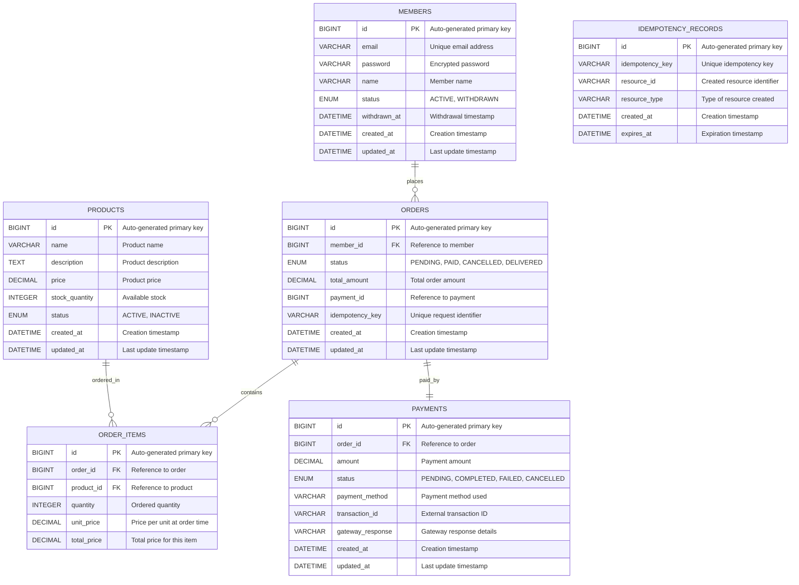

# Entity Relationship Diagram (ERD)

## Database Schema Overview

This document describes the entity relationships and database schema for the Client Management Application.

## Entity Relationship Diagram

## Table Descriptions

### MEMBERS
Stores member information including authentication data and account status.

**Key Features:**
- Unique email constraint for authentication
- Soft deletion with withdrawal mechanism
- 30-day withdrawal cancellation period
- Password encryption using BCrypt

**Indexes:**
- `idx_members_email` - Unique index on email
- `idx_members_status` - Index on status for filtering
- `idx_members_withdrawn_at` - Index for withdrawal cleanup

### PRODUCTS
Catalog of available products with inventory management.

**Key Features:**
- Stock quantity management
- Product status for availability control
- Price stored as decimal for precision
- Soft deletion via status field

**Indexes:**
- `idx_products_name` - Index for name-based searches
- `idx_products_status_stock` - Composite index for available products
- `idx_products_price` - Index for price range queries

### ORDERS
Central order management with status tracking.

**Key Features:**
- Idempotency key for duplicate prevention
- Status-based order lifecycle management
- Total amount calculation and storage
- Member relationship for order history

**Indexes:**
- `idx_orders_member_created` - Composite index for member order history
- `idx_orders_idempotency_key` - Unique index for idempotency
- `idx_orders_status` - Index for status-based queries

### ORDER_ITEMS
Line items for each order with snapshot pricing.

**Key Features:**
- Quantity and pricing at order time
- Product reference for catalog information
- Total price calculation per item
- Foreign key constraints for data integrity

**Indexes:**
- `idx_order_items_order_id` - Index for order lookup
- `idx_order_items_product_id` - Index for product analytics

### PAYMENTS
Payment processing records with gateway integration.

**Key Features:**
- Multiple payment method support
- Transaction ID tracking for external systems
- Gateway response storage for debugging
- Status tracking for payment lifecycle

**Indexes:**
- `idx_payments_order_id` - Unique index linking to orders
- `idx_payments_transaction_id` - Index for transaction lookup
- `idx_payments_status` - Index for payment status queries

### IDEMPOTENCY_RECORDS
Distributed idempotency management system.

**Key Features:**
- Request deduplication across services
- Resource type categorization
- Automatic expiration and cleanup
- Unique constraint on idempotency keys

**Indexes:**
- `idx_idempotency_key` - Unique index on idempotency key
- `idx_idempotency_expires_at` - Index for cleanup operations
- `idx_idempotency_resource_type_key` - Composite index for lookups

## Constraints and Business Rules

### Foreign Key Constraints
- `orders.member_id` → `members.id` (ON DELETE RESTRICT)
- `order_items.order_id` → `orders.id` (ON DELETE CASCADE)
- `order_items.product_id` → `products.id` (ON DELETE RESTRICT)
- `payments.order_id` → `orders.id` (ON DELETE RESTRICT)

### Unique Constraints
- `members.email` - Prevents duplicate accounts
- `orders.idempotency_key` - Prevents duplicate orders
- `payments.order_id` - One payment per order
- `idempotency_records.idempotency_key` - Unique idempotency keys

### Check Constraints
- `products.price >= 0` - Non-negative prices
- `products.stock_quantity >= 0` - Non-negative stock
- `order_items.quantity > 0` - Positive quantities
- `payments.amount > 0` - Positive payment amounts

## Data Flow Scenarios

### Order Creation Flow
1. **Member Authentication** - Validate member status and permissions
2. **Product Validation** - Check product availability and stock
3. **Stock Reservation** - Atomically decrease product stock
4. **Order Creation** - Create order with PENDING status
5. **Payment Processing** - Create payment record and process
6. **Order Completion** - Update order status to PAID
7. **Idempotency Recording** - Store request identifier

### Stock Management Flow
1. **Stock Check** - Verify available quantity
2. **Optimistic Locking** - Prevent overselling scenarios
3. **Stock Reservation** - Temporarily hold inventory
4. **Order Processing** - Complete or rollback transaction
5. **Stock Release** - Return inventory on cancellation

### Member Withdrawal Flow
1. **Withdrawal Request** - Mark member as WITHDRAWN
2. **Grace Period** - Allow 30-day cancellation window
3. **Data Cleanup** - Remove expired withdrawal records
4. **Account Reactivation** - Restore member access if cancelled

## Performance Considerations

### Query Optimization
- **Composite Indexes** - Optimized for common query patterns
- **Covering Indexes** - Reduce disk I/O for frequent queries
- **Partial Indexes** - Index only relevant data subsets

### Scalability Features
- **Horizontal Partitioning** - Orders can be partitioned by date
- **Read Replicas** - Product catalog can use read-only replicas
- **Connection Pooling** - Efficient database connection management

### Monitoring Metrics
- **Query Performance** - Track slow queries and optimization
- **Index Usage** - Monitor index hit ratios and effectiveness
- **Lock Contention** - Identify and resolve deadlock scenarios
- **Storage Growth** - Plan for data retention and archival